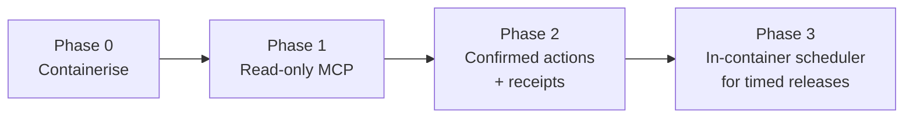

Repo not yet public — will be linked from here once published.

**The problem.** Booking a resort stay involves a repetitive multi-step research-and-booking workflow that an LLM could plausibly help drive end-to-end. But letting an LLM take booking or cancellation actions unsupervised is risky: a hallucinated date, a misread price, or a premature "confirm" could cost real money with no human in the loop.

**The design decision.** Expose deterministic booking verbs as MCP tools and let Claude orchestrate the surrounding workflow (research → plan → validate → rehearse → book → confirm), but require an explicit `confirm:true` from the user in chat before any side-effectful tool call (book, cancel) executes. The MCP server itself runs as a local-first HTTP/SSE service in Docker rather than a stdio-spawned process, because stdio MCP servers die per-chat session — incompatible with a later phase that needs the server to keep running in the background for scheduled work. Rollout is phased rather than all-at-once: containerise first, then read-only MCP (research/lookup tools only, nothing that can write), then confirmed write actions with receipts, then an in-container scheduler for timed releases. Currently in **Phase 0**: containerising the local Docker/HTTP-SSE server itself — nothing built on top of it yet, no MCP tools exposed, no read or write capability.

**The trade-off.** HTTP/SSE over stdio trades the simplicity of "spawn a process per chat session, no server to run" for a persistent local server that has to be kept running and, eventually, migrated to real infrastructure (AWS/Terraform/EKS is the stated future path) — durability for scheduled work at the cost of operational surface a stdio server wouldn't have. Similarly, gating every write behind `confirm:true` and shipping read-only tools before any write capability slows initial usefulness in exchange for making the side-effectful failure mode (an unwanted booking or cancellation) require a human in the loop by construction, not by convention.

