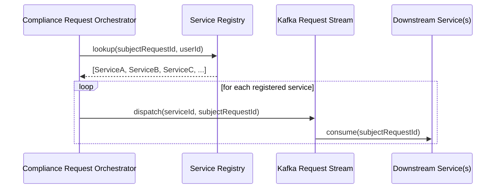

**The problem.** Downstream services that hold user data change over time — new services launch, existing ones get merged, and old ones get retired. If a compliance orchestrator's dispatch list is hardcoded, every new PII-holding service requires an orchestrator code change and redeploy, and it's easy to forget to update the list when a service is decommissioned or a new one ships. Miss an update either way and a GDPR/CCPA request either fans out to a service that no longer exists, or — worse — silently skips one that should have been included.

**The design decision.** Rather than hardcode routing, the orchestrator queries a service registry at request time to determine which downstream services to dispatch a given request to. Services register themselves (and what user data they hold) once; the orchestrator's dispatch logic becomes a lookup against that registry, not a static list maintained by whoever owns the orchestrator. The registry is intentionally separate storage from the orchestrator's own request-state DB — not the same DynamoDB table wearing two hats — so registry writes (a service onboarding or updating its declared data) can't contend with or get coupled to the orchestrator's per-request state churn.

**The trade-off.** Indirection adds a runtime dependency: if the registry is unavailable or stale, fan-out either stalls or silently under-dispatches. The mitigation is to treat the registry as load-bearing infrastructure rather than a side table, and to fail closed — stall and alert — rather than fan out on a possibly-incomplete list. Compared to the obvious alternative (a hardcoded service list reviewed at each release), the registry trades a small amount of runtime complexity and an extra failure mode for near-zero onboarding friction on the compliance side: new services self-serve into GDPR/CCPA coverage instead of waiting on an orchestrator owner to add them.

