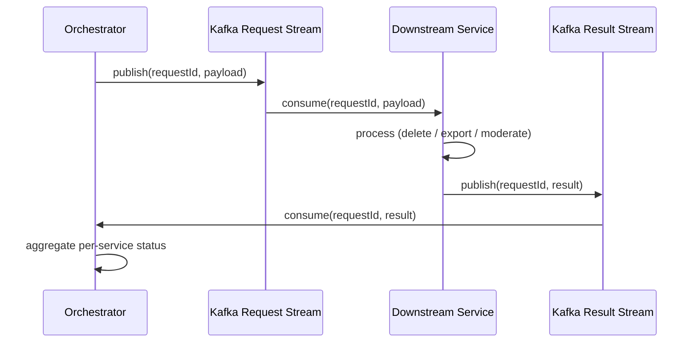

**The problem.** A single shared Kafka topic carrying both "here's a request" and "here's a result" messages forces every consumer to filter for its own message type, and a slow or failing downstream consumer can back up the topic for everyone — including results flowing the other direction. Replay is messy too: rewinding "from the beginning" replays both directions of traffic at once, even if only one side actually needs reprocessing.

**The design decision.** Split into two streams: a request stream carrying outbound dispatch (orchestrator → downstream) and a separate result stream carrying the response direction (downstream → orchestrator). Each stream has its own replay point, so a downstream that needs to reprocess its inbound requests can rewind independently of the orchestrator's aggregation logic, and vice versa.

**The trade-off.** Two streams means two things to provision, monitor, and reason about instead of one — more moving infrastructure for a marginal conceptual win if traffic is genuinely low or single-consumer. It paid off here because the two directions have different consumers, different failure domains (an orchestrator-side bug shouldn't be able to wedge a downstream's inbound queue, and vice versa), and different replay needs — worth the extra topic for systems where one incident shouldn't cascade across both the fan-out and its aggregation.

